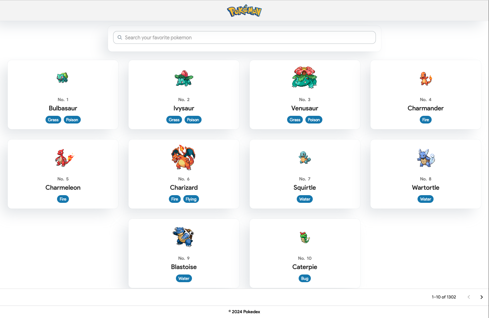

<!-- PROJECT LOGO -->
<br />
<h1 align="center">Pokédex</h1>

  <p align="center">
    A VITE application to simulate a simple pokédex
    <br />
    <a href="https://github.com/magnusfernandes/pokedex-react/issues">Report Bug</a>
    ·
    <a href="https://github.com/magnusfernandes/pokedex-react/issues">Request Feature</a>
  </p>
</p>

<!-- TABLE OF CONTENTS -->
<details open="open">
  <summary>Table of Contents</summary>
  <ol>
    <li>
      <a href="#about-the-project">About The Project</a>
      <ul>
        <li><a href="#built-with">Built With</a></li>
      </ul>
    </li>
    <li>
      <a href="#getting-started">Getting Started</a>
      <ul>
        <li><a href="#prerequisites">Prerequisites</a></li>
        <li><a href="#installation">Installation</a></li>
      </ul>
    </li>
    <li><a href="#roadmap">Roadmap</a></li>
    <li><a href="#contact">Contact</a></li>
    <li><a href="#acknowledgements">Acknowledgements</a></li>
  </ol>
</details>

<!-- ABOUT THE PROJECT -->

## About The Project



The Pokédex records every Pokémon a Trainer has seen or caught during an adventure.

- Show Pokémons based on their order
  - Search Pokémon
  - Browse or get Pokémon information
- Redux implementation

> Search function doesn't work because [Pokéapi](https://pokeapi.co/) doesn't support it yet.

### Built With

- [React JS](https://reactjs.org/)
- [Vite](https://vitejs.dev/)
- [Typescript](https://www.typescriptlang.org/)
- [Sass](https://sass-lang.com/)

<!-- GETTING STARTED -->

## Getting Started

To get it up and running locally, follow these simple steps.

### Prerequisites

Require Node to run this project

- npm
  ```sh
  npm install npm@latest -g
  ```

### Installation

1. Clone the repo
   ```sh
   git clone https://github.com/magnusfernandes/pokedex-react.git
   ```
2. Install NPM packages
   ```sh
   npm install
   ```
3. Excute the application
   ```sh
   npm run dev
   ```

<!-- ROADMAP -->

## Roadmap

See the [open issues](https://github.com/magnusfernandes/pokedex-react/issues) for a list of proposed features (and known issues).

<!-- CONTACT -->

## Contact

Magnus Fernandes - (magnusfernandes1295@gmail.com)

Project Link: [https://github.com/magnusfernandes/pokedex-react](https://github.com/magnusfernandes/pokedex-react)

<!-- ACKNOWLEDGEMENTS -->

## Acknowledgements

- [Typescript](https://www.typescriptlang.org/) : Used for error free code and faster developement
- [Sass](https://sass-lang.com/) : CSS pre-processor used for better structuring of the styles
- [Axios](https://axios-http.com/) : To make API request
- [React Router](https://reactrouter.com/web/guides/quick-start) : Used for routing of pages
- [Font Awesome](https://fontawesome.com/): Icon library
- [Pokéapi](https://pokeapi.co/): Pokémon API

<br />

Thank you for using Pokedex React! Happy exploring!
